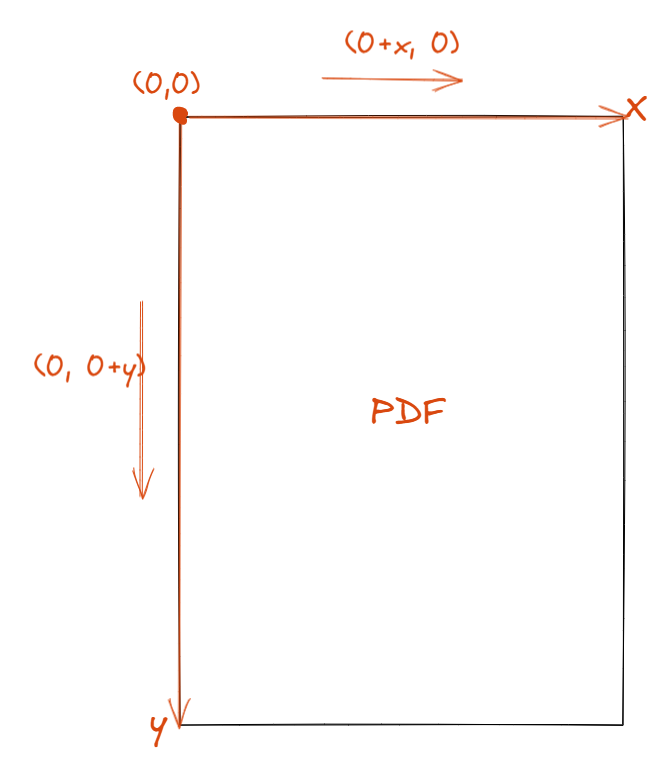

# The encapsulation of PDFBox

> Author1: Akio
>
> Author2: Bzovo

## other
gitee https://gitee.com/Grantr/the-encapsulation-of-pdfbox
<br/>
github https://github.com/Grant-Vranes/The-encapsulation-of-PDFBox

## 介绍
这个项目使用SpringBoot，纯纯的一个工具类，主要操作方法再pdfBoxCtl包下。结合这些方法可以做到“根据关键字限定范围(页数)或确定矩形、扩展矩形，提取其中文本或者截图”<br>
使用PDFBox文件相关坐标如下
```xml
<dependency>
    <groupId>org.apache.pdfbox</groupId>
    <artifactId>pdfbox</artifactId>
    <version>2.0.13</version>
</dependency>

<dependency>
    <groupId>org.apache.pdfbox</groupId>
    <artifactId>fontbox</artifactId>
    <version>2.0.13</version>
</dependency>

<dependency>
    <groupId>org.apache.pdfbox</groupId>
    <artifactId>jempbox</artifactId>
    <version>1.8.11</version>
</dependency>

<dependency>
    <groupId>org.apache.pdfbox</groupId>
    <artifactId>xmpbox</artifactId>
    <version>2.0.0</version>
</dependency>

<dependency>
    <groupId>org.apache.pdfbox</groupId>
    <artifactId>preflight</artifactId>
    <version>2.0.0</version>
</dependency>

<dependency>
    <groupId>org.apache.pdfbox</groupId>
    <artifactId>pdfbox-tools</artifactId>
    <version>2.0.0</version>
</dependency>
```


## 已封装功能

#### basement包

> **BaseTools**
>
> | method                                       | description                                                  |
> | -------------------------------------------- | ------------------------------------------------------------ |
> | MultipartFileToFile(MultipartFile multiFile) | MultipartFile文件转File文件，对接前端传递的MultipartFile文件数据 |
> | deleteTempFile(File file)                    | 删除临时文件                                                 |

> **BoxKeyPosition**核心类，其中方法请勿直接使用
>
> | method                                                       | description                                    |
> | ------------------------------------------------------------ | ---------------------------------------------- |
> | BoxKeyPosition(byte[] src)                                   | 构造方法                                       |
> | BoxKeyPosition(String keyWords, byte[] src)                  | 含关键词的构造方法                             |
> | getPosition()                                                | 遍历所有页，获取所有存在此关键字的矩形         |
> | getPosition(Integer startIndex)                              | 从当前页面开始遍历，获取所有存在此关键字的矩形 |
> | getPosition(Integer[] scope)                                 | 查找固定范围内，存在此关键字的矩形             |
> | getPositionFirst(Integer startIndex)                         | 若水三千，我只取startIndex之后的第一瓢         |
> | getAllPage()                                                 | 获取PDF文件总页数                              |
> | getPositionFirst(Integer[] scope)                            | 从圈定的目录范围内，查找关键词的第一个RectPos  |
> | getPositionFirst()                                           | 从整个PDF中，找关键词的第一个RectPos           |
> | writeString(String string, List\<TextPosition\> textPositions) | 填充RectPos的数据项                            |

> **PdfboxUtils**核心类，请勿直接使用此方法
>
> | method                                                       | description                        |
> | ------------------------------------------------------------ | ---------------------------------- |
> | readRectangelText(File file, int nowPage, Rectangle textRrect) | 根据指定文件页码的指定区域读取文字 |
> | readPageText(File file, int nowPage)                         | 提取nowPage页面所有文本            |
> | readRectangelImage(File file, int nowPage, Rectangle imgRrect) | 根据指定文件页码的指定区域读取图片 |

> **Base64Util**
>
> | method                                    | description                                              |
> | ----------------------------------------- | -------------------------------------------------------- |
> | convertimgtoBase64(BufferedImage image)   | 将BufferedImage类型的图片文件转换为Base64字符串          |
> | base64ToImage(String base64, String path) | 对图片字符串进行Base64解码并生成图片                     |
> | imageToBase64(String path)                | 将图片文件转化为字节数组字符串，并对其进行Base64编码处理 |

<hr>

#### model包

> **RectPos**核心实体模型
>
> ```java
> private Integer x; // 查询关键词的x坐标
> private Integer y; // 查询关键词的y坐标
> private Integer width; // 查询关键词的宽度
> private Integer height; // 查询关键词的高度
> private Integer pageFrom;
> private Integer endX; // 当前无用
> private Integer endY; // 当前无用
> private Integer pageWidth; // 当页PDF宽度
> private Integer pageHeight; // 当页PDF高度
> ```
>
> 对于PDFBox组件对坐标的定义，以pdf文件页面左上角为原点，享有第二象限为正，往右移动加数据，往下移动加数据
>
> 


<hr>

#### pdfBoxCtl包

> **BaseMethod**基本方法
>
> | method              | description       |
> | ------------------- | ----------------- |
> | getPages(File file) | 获取PDF文件总页数 |

> **CatalogMethod**针对PDF目录有关方法
>
> | method                                                       | description                                                  |
> | ------------------------------------------------------------ | ------------------------------------------------------------ |
> | whereIsCatalog(File file, String catalog_keywords)           | 判断目录在哪一页，需要传入确认目录的关键词，如“目录”，“Table of content” |
> | ScopeOfCatalog(File file, String catalog_keywords, String catalog_features) | 判断目录所在范围<br />确认目录的关键词，如“目录”，“Table of content”<br />确认目录特征词，如“......”，可以指定，传入null则默认为'......' |
> | getPageNumFromCatalog(File file, String titleName, Integer[] scope) | 从圈定的目录范围查找存在的关键字，并返回目录映射页码,二次确认，能排除避免可能出现的表头也有关键字的情况，默认以“...”作为目录特征词。scope是目录的范围 |
> | getPageNumFromCatalog(File file, String titleName, Integer[] scope, String catalog_features) | 从圈定的目录范围查找存在的关键字，并返回目录映射页码,二次确认，能排除避免可能出现的表头也有关键字的情况,可自定义传入目录特征词catalog_features |

> **KeyLocation**封装对于PDFBox组件的基本操作方法：提取关键词在PDF文件中所在的RectPos
>
> | method                                                       | description                                                  |
> | ------------------------------------------------------------ | ------------------------------------------------------------ |
> | getKeyLocation(File file, String keyWords)                   | 获取此关键词再PDF文件中所在位置的RectPos模型集合             |
> | getKeyLocation(File file, String keyWords, Integer[] scope)  | 查找此关键词在PDF文件scope范围内所有位置的RectPos的集合      |
> | getKeyLocationFirst(File file, String keyWords)              | 获取该关键词在PDF文件中的第一个RectPos对象                   |
> | getKeyLocationFirst(File file, String keyWords, Integer startIndex) | 从设定的startIndex页数查找后面所有的keyWords(关键词)的RectPos对象的第一个（包括startIndex此页） |
> | getKeyLocationFirst(File file, String keyWords, Integer[] scope) | 从圈定的范围中找所有的keyWords的RectPos的第一个。圈定的页面范围，[x,y]，包括x和y当页 |
> | getKeyLocationFirst(File file, String keyWords[], Integer startIndex) | 从设定的startIndex页面开始找后面的keyWords数组中某一个的RectPos的第一个。<br />keyWords数组中根据顺序遍历，找到谁算谁的 |

> **RegionalMethod**确定区域之后的方法
>
> | method                                                       | description                                                  |
> | ------------------------------------------------------------ | ------------------------------------------------------------ |
> | getPhotos2Base64(File file, int startIndex, int endIndex)    | 提取[startIndex, endIndex]范围内的图片，转换为Base64格式集合<br />注意：图片提取的顺序是PDF创建时图片插入的顺序，并非页面图片展示的顺序 |
> | getRectImage(File file, Integer pageIndex, Rectangle rect_cut) | 截取pageIndex页面的rect_cut矩形为base64格式图片              |
> | getRectImage(File file, Integer pageIndex, List\<Rectangle\> rect_cut) | 截取pageIndex页面中的矩形集合为base64图片集合                |
> | getRectImage(File file, Integer startIndex, Integer endIndex, List\<Rectangle\> rect_cut) | 截取[startIndex, endIndex]中的矩形为图片，每个页面对应一个rect_cut集合中一个矩形<br />注意：需要确保endIndex-startIndex=rect_cut.size() |


## 参考

https://www.cnblogs.com/yjd_hycf_space/p/7942444.html

https://www.yiibai.com/pdfbox/pdfbox_adding_rectangles.html

https://blog.csdn.net/Fighting_No1/article/details/51038966

https://blog.csdn.net/qq_39225639/article/details/119344997

https://blog.csdn.net/wei15801110272/article/details/79237139

http://www.yiidian.com/pdfbox/pdfbox-get-location-and-image-size.html

https://codingdict.com/questions/116891
